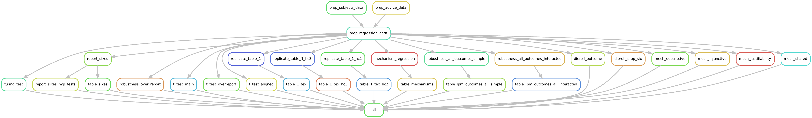

# A Replication of "Corrupted by Algorithms?"

<!-- [](https://travis-ci.org/lachlandeer/snakemake-econ-r) -->
[](https://github.com/lachlandeer/snakemake-econ-r/actions/workflows/build.yaml)
[](https://www.tidyverse.org/lifecycle/#maturing)
[]()

## Project

Our project involves replicating the main tables and figures of Leib et al's EJ article "[Corrupted by Algorithms? How AI-generated and Human-written Advice Shape (Dis)honesty.](https://academic.oup.com/ej/article/134/658/766/7269206)"

## Installation Instructions

Follow these Steps to install the necessary software on your system

You need to have the following software and packages installed:

1. Python 3 (Python 3.6 or higher)
2. Snakemake (we'll install the correct version in a couple of lines time!)
3. R (version 4.X.x)
### Installing Python

Either:

1. Install Anaconda Python:
    - We provide instructions on how to install anaconda python [here](https://pp4rs.github.io/2020-uzh-installation-guide/python/)
2. Install Python using the deadsnakes ppa:
    - Here's how to add the deadsnakes ppa and install Python 3.10
    ```bash
    $ sudo apt-get install software-properties-common
    $ sudo add-apt-repository ppa:deadsnakes/ppa
    $ sudo apt-get update
    $ sudo apt-get install python3.10
    ```

### Installing Snakemake

We have included a `requirements.txt` file that we can use to install a specific version of snakemake.
This makes sure that our example runs on your machine (or at least won't break because you use a different version of snakemake than we do)

``` bash
pip3 install -r requirements.txt
```

you may need to replace `pip3` with `pip`


### Installing `R`

You need to have R version 4.X.X installed on your system and callable from a terminal session.

### Install the Required `R` libraries

We utilize many additional R packages inside the scripts that build our project.
To ensure that our project runs on every machine without issues relating to R packages not being installed we utilize `renv` to control the list of packages needed to run this example, and to monitor the version of the package we use.

Once you have completed the installation instructions above, we have provided a simple command to install renv.
Open a terminal and navigate to this directory.
Then in the terminal enter the following command to install renv:

``` bash
snakemake --cores 1 renv_install
```

Then you will need to provide consent for `renv` to be able to write files to your system:

``` bash
snakemake --cores 1 renv_consent
```

Once this is complete you can use renv to create a separate R environment that contains the packages we use in our example by entering the following command into the terminal:

``` bash
snakemake --cores 1 renv_init
```

The above command will initialize a separate R environment for this project.

Now we will install the necessary packages (and their precise versions) which are stored in the `renv.lock` file:

``` bash
snakemake --cores 1 renv_restore
```

This will install all the packages we need. It may take a while.

## Running the Code

Once the installation instructions are complete, we can run the project.
The result will be all figures (PDF), tables (TeX)  and any additional statistics used (JSON files) in the replication report

To run the project, enter the following into the terminal:

``` bash
snakemake --cores 4 all
```

This will run through all the R scripts in order to complete the build of the project.

## Visualization of the Workflow

Snakemake workflows are a directed acyclic graph (DAG).
We can visualize the relationship between the rules (a simplified view of the DAG) in our workflow:



Check out the rules in `./rules/dag.smk` for various visualizations of the workflow. 
You will need to install `graphviz` to run these rules - we have included a rule inside `dag.smk` to install this for you. 

## Archiving `R` packages in a new project

* If you are starting a new project, which is likely if you are using
   this template, you need to initialize a new renv instance to
   track your `R` packages and store them.
   Enter the following command into the same terminal as above
   and press `Return`.

   ``` bash
   snakemake --cores 1 renv_init
   ```

* If we add new `R` packages that we want to include in a project, we take a `snapshot` of the packages utilized in the project with:

```bash
snakemake --cores 1 renv_snap
```

## Comments / Suggestions / Issues

We'd love to hear your comments, suggestions or installation issues encountered when running the example.
[Post an issue on Github.](https://github.com/lachlandeer/replication-games-corrupted-algo/issues)

## Suggested Citation

TBD
